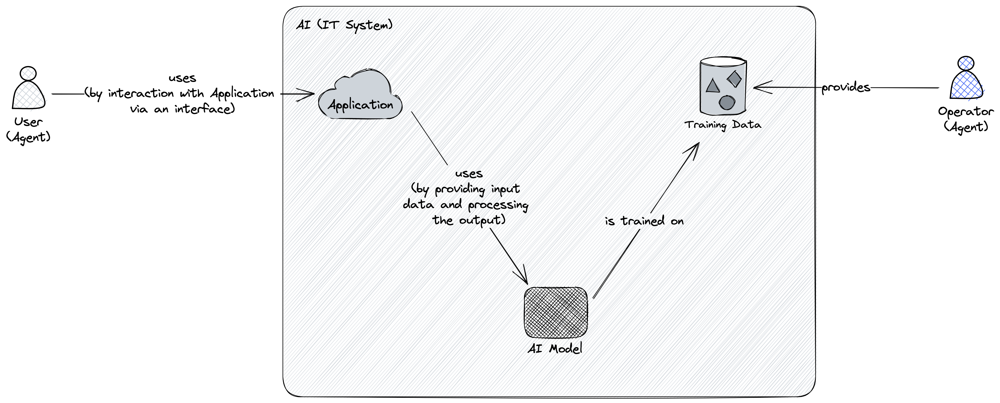
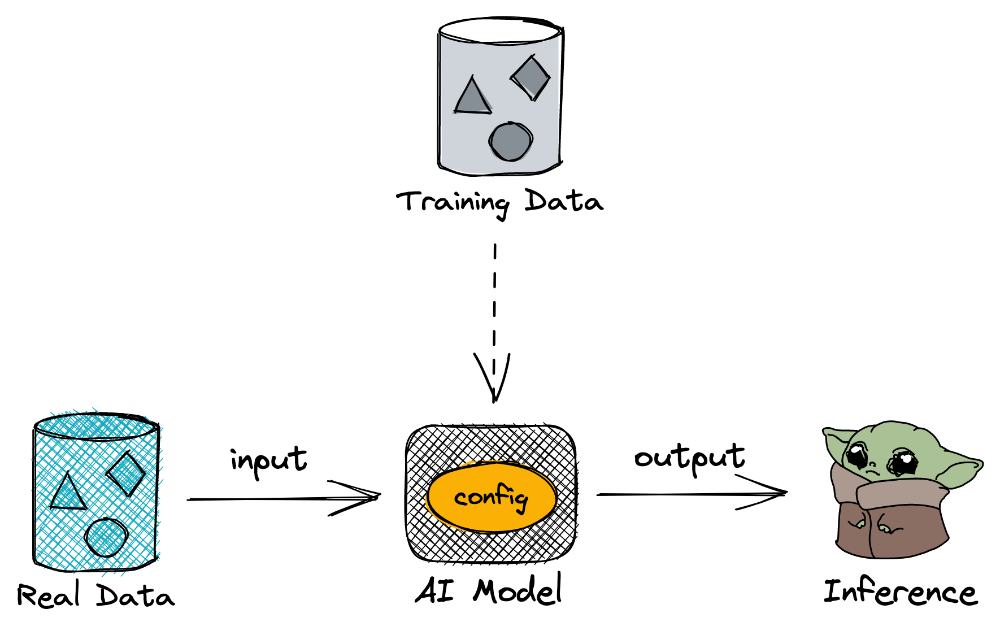

# SAOFAI (Working Version)
The working version of SAOFAI (Secure Adoption and Operation Framework for Artificial Intelligence).

## Overview

### Summary
SAOFAI is a community-driven standard that provides [guidelines](#guidelines) and [controls](#controls) for [entities](#entity) (i.e., individuals and organizations) to minimize [risks](#risk) and maximize [value](#value) of using [Artificial Intelligence (AI)](#artificial-intelligence-ai) in their [operations](#operations). SAOFAI recognizes specific [adoption](#adoption-architectures) and [operation](#operation-architectures) architectures that the [focal entity](#entity) can choose from to integrate [AI](#artificial-intelligence-ai) with their [processes](#process).

It is open-source, developed by an international, interdisciplinary community of experts through a democratic process. All changes are transparent, discussed, and voted on by the community to mitigate the effects of subjective biases and incentives.

### Audience
The target audience of SAOFAI includes individuals and organizations aiming to automate their [operations](#operations) with [AI](#artificial-intelligence-ai). These [entities](#entity) thus face the dual challenges of, firstly, [adopting](#adoption) and, secondly, [operating](#operation) their processes supported by [AI](#artificial-intelligence-ai).

### Objective
The primary objective of SAOFAI is to minimize the operational, strategic, compliance, reputational, and cybersecurity [risks](#risk) associated with the [adoption](#adoption) and [operation](#operation) of [AI](#artificial-intelligence-ai). The secondary objective is to maximize [value](#value) by reducing costs and increasing benefits derived from [AI](#artificial-intelligence-ai).

### Rationale
SAOFAI recognizes the inherent unpredictability of [AI](#artificial-intelligence-ai), compared to traditional [IT solutions](#it-system). [AI's](#artificial-intelligence-ai) potential to evolve, learn, and make decisions independently allows it to be a dynamic, adaptable tool that can enhance business operations and derive value in unprecedented ways. However, this potential also brings substantial business [risks](#risk). SAOFAI addresses this conundrum by creating a secure framework that empowers businesses to safely derive [value](#value) from [AI](#artificial-intelligence-ai). It seeks to balance the beneficial autonomy of [AI](#artificial-intelligence-ai) with a well-structured and robust [control](#control) mechanism that mitigates [risks](#risk), thus providing a comprehensive roadmap for the secure [adoption](#adoption-architectures) and [operation](#operations) of [AI](#artificial-intelligence-ai) within business environments.

### Structure
First, the document [defines](#definitions) all concepts used in the document. Next, in the main part, the document discusses [operation architectures](#operation-architectures) and [adoption architectures](#adoption-architectures). There, SAOFAI identifies risks and possible benefits each architecture could offer to the [focal entity](#entity) in corresponding context (in the adoption and operation phases), and finally, exhibits case studies to exemplify them.

### Contributions
Contributions to the projects are done via the [Pull Requests](https://docs.github.com/en/pull-requests/collaborating-with-pull-requests/proposing-changes-to-your-work-with-pull-requests/creating-a-pull-request). After a new PR is created, the community (contributors listed in the [Contributors](https://github.com/SAOFAI/Framework#contributors) chapter) vote on it. Once at least have of them [approves the change](https://docs.github.com/en/pull-requests/collaborating-with-pull-requests/reviewing-changes-in-pull-requests/reviewing-proposed-changes-in-a-pull-request), the change is merged to the `main` branch.

## Definitions

### Guidelines
SAOFAI establishes *guidelines* for implementing selected AI [adoption](#adoption-architectures) and [operation](#operation-architectures) architectures in the [focal entity](#entity).

### Control
A *control* is a quantifiable metric, or a KPI (key performance indicator), of a specific area of interest. SAOFAI defines controls along with every [guideline](#guidelines), to help measuring its implementation in the [focal entity](#entity).

### Entity
An *entity* is an individual or an organization that operates using [processes](#process) and interacts with the [environment](#environment). To differentiate from other entities operating in the [environment](#environment), the entity implementing SAOFAI is referred to as the *focal entity*.

### Risk
*Risk* refers to the potential for loss or adverse outcomes due to the implementation and utilization of [AI](#artificial-intelligence-ai) within the [focal entity's](#entity) [processes](#process). Such risks are shaped by the [environment](#environment) and may include technical issues, data privacy concerns, ethical implications, regulatory changes, employee resistance, customer impacts, to name a few.

### Value
*Value* refers to the potential for benefit or utility of the implementation and utilization of [AI](#artificial-intelligence-ai) within the [focal entity's](#entity) [processes](#process), in comparison to the baseline (i.e., without [AI](#artificial-intelligence-ai)) [processes](#process). Such value may include enhancement of operational efficiency, generation of insightful data for decision-making, automation of repetitive tasks, prediction of future trends and behaviors, augmentation of human capabilities, to name a few.

### Artificial Intelligence (AI)

Drawing upon the definition by Russel (Russel 2010), SAOFAI defines AI as an [IT system](#it-system) that contains an [AI model](#ai-model) which solves a [domain problem](#domain-problem). Application provides an interface to a user ([human agent](#human-agent)), via which the user can formulate the problem. Then, the [application](#application) translates it to the input understandable by the [AI model](#ai-model), and translates an inference produced by the model back to the user via the interface.

Since [AI models](#ai-model) can only learn how to solve [domain problems](#domain-problem), [training data](#training-data) is an integral part of the AI system. In order to teach the model, an [operator](#operator) provides [training data](#training-data) and performs training activities.

### Domain Problem
A *domain problem* refers to a specific issue or challenge within a certain field or discipline that an [AI](#artificial-intelligence-ai) system is designed to solve or address. These problems are usually complex and require specialized knowledge of the domain. The [AI model](#ai-model) within the AI system is trained to solve these domain problems by learning from relevant [training data](#training-data). The domain problem could range from predicting customer behaviors in marketing, diagnosing diseases in healthcare, identifying fraudulent transactions in banking, to automating repetitive tasks in various industries.

### (Human) Agent
A *(Human) Agent* refers to an individual (specifically, but not limited to, human) who performs specific activities within a [process](#process). Agents possess specific [capabilities](#capability) that allow them to alter the states of activities they are engaged in. They could be employees, managers, or any other individuals involved in the operation of a business process. Within the framework of AI-supported processes, a human agent may interact with the [AI system](#artificial-intelligence-ai), providing inputs and receiving outputs through an interface of an [application](#application).

### Operator
An *Operator* refers to the individual or team responsible for the development, training, and maintenance of an [AI system](#artificial-intelligence-ai). The Operator prepares and provides the [training data](#training-data) required to teach the [AI model](#ai-model), conducts the model training activities, and adjusts the system as needed based on performance feedback and changes in the operational environment. The Operator plays a crucial role in shaping the behavior and performance of the AI model, and thus carries a significant share of the responsibility for minimizing associated risks and maximizing value from the AI system.

### IT System
An *IT System* refers to an integrated set of modules and subsystems (e.g., hardware, software, data, models, etc.) that work together to deliver digital services or process digital information. The components work together to deliver a defined set of functionalities.

### Application
An *Application* is a subsystem of an [AI system](#artificial-intelligence-ai) that serves as an interface between the [AI model](#artificial-intelligence-ai) and a user (a [human agent](#human-agent)). This application enables the user to formulate a problem or input data that is then translated into a form understandable by the [AI model](#ai-model). Upon processing this input, the AI model produces an output ([inference](#inference)) which the application then translates back into a form that the [human agent](#human-agent) can understand. Essentially, the application functions as a translator and communicator between the [human agent](#human-agent) and the [AI model](#artificial-intelligence-ai), enabling meaningful interactions and enhancing the usability of the [AI system](#artificial-intelligence-ai). It is the bridge that allows for the practical use of [AI models](#ai-model) in the context of specific [domain problems](#domain-problem).

### AI Model
Drawing upon the definition by Russel (Russel 2010), SAOFAI defines an AI model as a [subsystem](#it-system) of an [AI system](#artificial-intelligence-ai) that transforms inputs ([real data](#real-data)) into outputs ([inference](#inference)) by extrapolating patterns found in [training data](#training-data). In this view, the behavior of the model is a derivative of its configuration and the training data, and can only be changed by retraining with different variations of those.

As suggested by Arrieta (Arrieta 2020), there are two categories of AI models which represent opposite polars of the spectrum:

- **black-box models** whose inference logic is hardly understandable to an external observer (i.e., a [human agent](#human-agent)),
- **explainable models** which "enable humans to understand, appropriately trust, and effectively manage the emerging generation of artificially intelligent partners" (Arrieta 2020).

### Training Data
*Training data* refers to the dataset used to train an [AI model](#ai-model). This data is typically a comprehensive, well-structured, and often times moderated collection of relevant information that reflects the variety and complexity of the [domain problem](#domain-problem) the [AI model](#ai-model) is designed to solve. It includes both the inputs that the model should process and the desired outputs (also known as labels in supervised learning), allowing the [AI model](#ai-model) to learn the patterns and relationships needed to make accurate predictions or decisions.

Noteworthy, quality, diversity, and representativeness of the training data significantly influence the performance and reliability of the [AI model](#ai-model) (Kilkenny 2018). SAOFAI recognizes the training data as an integral part of the [AI system](#artificial-intelligence-ai), given the model's behavior is tightly coupled with the training data.

### Real Data
*Real data* refers to the actual data that an [AI model](#ai-model) processes in a live or operational environment after it has been trained with [training data](#training-data). This can be any form of input that the model receives during its operations to make predictions, generate insights, drive decision-making, etc. The model's performance and effectiveness are measured based on how well it handles and processes this real data.

### Inference
*Inference* refers to the output produced by an [AI model](#ai-model) in response to a specific input from [real data](#real-data) in a live or operational environment. The inference is derived from patterns the model has learned during its training phase with [training data](#training-data). This output could be a prediction, a classification, a recommendation, or any other kind of decision or insight that the [AI model](#ai-model) is designed to provide based on the input data.

### Operations
*Operations* refer to the day-to-day activities and tasks carried out by an [entity](#entity) to achieve its objectives. They are organized into [processes](#process), which are structured sets of related activities performed by [agents](#human-agent). Operations span across the [focal entity](#entity) and other entities from the [environment](#environment).

### Process
A process is a set of related activities that are performed by an agent (human or non-human) who has specific [capabilities](#capability) to change states of the activities (Howard 2003). See the [baseline integration model](#baseline) as an example.

### Capability
A *capability* refers to specific abilities or skills possessed by an [agent](#human-agent) (either human or artificial) that enable them to perform a class of activities within a [process](#process).

### Environment
An environment consists of a variety of [entities](#entity) that interact with the *focal entity* and each other, and in result have direct impact on [risks](#risk) and [values](#value) in the ecosystem.

## Operation Architectures
This chapter describes architectures for business processes integrated with AI, and discusses each architecture's risks and potential benefits in the operational context. In simple terms, operational architectures are possible configurations in which an entity can operate an AI-supported business process.

### Baseline
As the baseline, meaning without any AI support, the focal entity is expected to operate processes that comprise only non-AI agents who have certain capabilities to work on activities.

Following sections describe strategies of operating the baseline process with AI, identified by SAOFAI.

#### Potential benefits
*[WIP]*

#### Risks
*[WIP]*

#### Case study
*[WIP]*

### AI-supported Activity

#### Value
*[WIP]*

#### Risks
*[WIP]*

#### Case study
*[WIP]*

### AI-supported Agent

#### Value
*[WIP]*

#### Risks
*[WIP]*

#### Case study
*[WIP]*

### AI Agent

#### Value
*[WIP]*

#### Risks
*[WIP]*

#### Case study
*[WIP]*

## Adoption Architectures
This section describes architectures for implementing [operation architectures](#operation-architectures) in the [focal entity](#entity), and discusses on the risks and possible advantages each approach could offer in the context of adoption. In simple terms, adoption architectures represent various ways a company can adopt AI in their business operations.

*[WIP]*

## Contributors
*[WIP]*

## References
- Arrieta, Alejandro Barredo, Natalia Díaz-Rodríguez, Javier Del Ser, Adrien Bennetot, Siham Tabik, Alberto Barbado, Salvador García et al. "Explainable Artificial Intelligence (XAI): Concepts, taxonomies, opportunities and challenges toward responsible AI." Information fusion 58 (2020): 82-115.
- Kilkenny, Monique F., and Kerin M. Robinson. "Data quality:“Garbage in–garbage out”." Health Information Management Journal 47, no. 3 (2018): 103-105.
- Russell, Stuart J. Artificial intelligence a modern approach. Pearson Education, Inc., 2010.
- Smith, Howard. "Business process management—the third wave: business process modelling language (bpml) and its pi-calculus foundations." Information and Software Technology 45, no. 15 (2003): 1065-1069.
