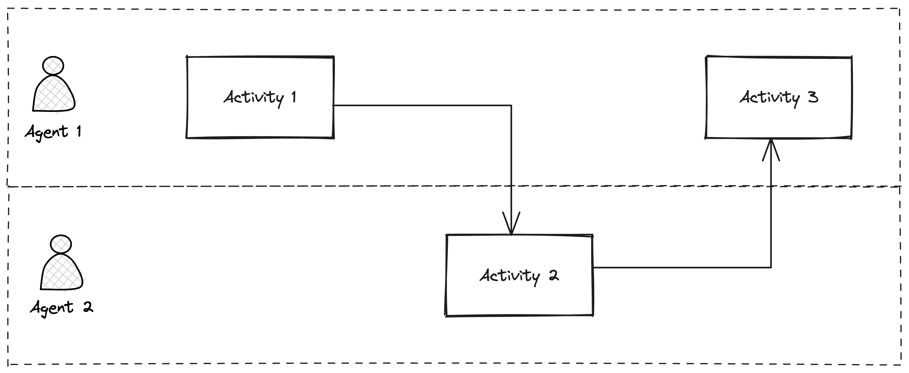

# Framework (Working Version)
The working version of SAOFAI (Secure Adoption and Operation Framework for Artificial Intelligence).

## Overview

### Summary
SAOFAI is a community-driven standard that provides [guidelines](#guidelines) and [controls](#controls) for [entities](#entity) (i.e., individuals and organizations) to minimize [risks](#risk) and maximize the [value](#value) of using [Artificial Intelligence (AI)](#artificial-intelligence-ai) in their [operations](#operations). It is open-source, developed by an international, interdisciplinary community of experts through a democratic process. All changes are transparent, discussed, and voted on by the community to mitigate the effects of subjective biases and incentives.

### Audience
The target audience of SAOFAI includes individuals and organizations aiming to automate their [operations](#operations) with [AI](#artificial-intelligence-ai). These [entities](#entity) thus face the dual challenges of, firstly, [adopting](#adoption) and, secondly, [operating](#operation) their processes supported by [AI](#artificial-intelligence-ai).

### Objective
The primary objective of SAOFAI is to minimize the operational, strategic, compliance, reputational, and cybersecurity [risks](#risk) associated with the [adoption](#adoption) and [operation](#operation) of [AI](#artificial-intelligence-ai). The secondary objective is to maximize [value](#value) by reducing costs and increasing benefits derived from [AI](#artificial-intelligence-ai).

### Structure
This document is divided into two main parts - [Operation](#operation) and [Adoption](#adoption). The Operation section presents a blueprint for a [process](#process) integrated with [AI](#artificial-intelligence-ai), designed to serve as a flexible baseline that can be adapted to a specific [entity’s](#entity) needs. The Adoption section presents a blueprint for a project aimed at adopting the process by the entity. Both the Operation and Adoption sections further break down their respective phases into tasks, describe their objectives and contexts, and provide a list of [guidelines](#guidelines) and [controls](#control).

### Contributions
Contributions to the projects are done via the [Pull Requests](https://docs.github.com/en/pull-requests/collaborating-with-pull-requests/proposing-changes-to-your-work-with-pull-requests/creating-a-pull-request). After a new PR is created, the community (contributors listed in the [Contributors](https://github.com/SAOFAI/Framework#contributors) chapter) vote on it. Once at least have of them [approves the change](https://docs.github.com/en/pull-requests/collaborating-with-pull-requests/reviewing-changes-in-pull-requests/reviewing-proposed-changes-in-a-pull-request), the change is merged to the `main` branch.

## Definitions

**[Work in progress]**

### Guidelines

SAOFAI establishes *guidelines* for various approaches to adopting and operating AI within a focal entity.

### Control

A *control* is a quantifiable metric, or a KPI (key performance indicator), of a specific area of interest. SAOFAI defines controls along with every guideline, to help measuring its implementation in the focal entity.

### Entity

An *entity* is an individual or an organization that operates using [processes](#process) and interacts with the [environment](#environment). To differentiate from other entities operating in the environment, the entity implementing SAOFAI is referred to as the *focal entity*.

### Risk

**[Work in progress]**

### Value

**[Work in progress]**

### Artificial Intelligence (AI)

**[Work in progress]**

### Operations

**[Work in progress]**

### Process

According to Howard, a *process* is a set of related activities that are performed by an agent (human or non-human) who has specific *capabilities*  and changes a *state* of an activity by working on it (Howard 2003).

### Environment

The *environment* consists of a variety of entities that interact with each other. Notable entities that may influence the adoption and operation of AI by the focal entity are:
- customers
- partners
- regulatory bodies

## Operation

**[Work in progress]**

### Baseline

**[Work in progress]**

As a baseline, the focal entity is expected to operate with processes that consist of non-AI agents who have certain capabilities to work on activities.

Following sections describe strategies of operating the baseline process with AI, identified by SAOFAI.

### AI-supported Activity

**[Work in progress]**

### AI-supported Agent

**[Work in progress]**

### AI Agent

**[Work in progress]**

## Adoption

**[Work in progress]**

## Contributors

**[Work in progress]**

## References

- Smith, Howard. "Business process management—the third wave: business process modelling language (bpml) and its pi-calculus foundations." Information and Software Technology 45, no. 15 (2003): 1065-1069.
