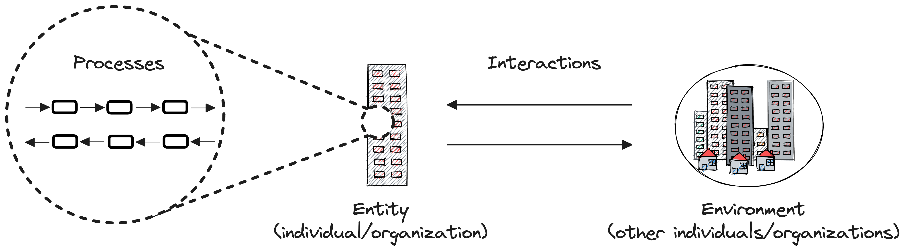

# Framework (Working Version)
The working version of SAOFAI (Secure Adoption and Operation Framework for Artificial Intelligence).

## Overview

### Summary
SAOFAI is a community-driven standard that provides guidelines and controls for [entities](#entity) (i.e., individuals and organizations) to minimize risks and maximize the value of using Artificial Intelligence (AI) in their operations. It is open-source, developed by an international, interdisciplinary community of experts through a democratic process. All changes are transparent, discussed, and voted on by the community to mitigate the effects of subjective biases and incentives.

### Audience
The target audience of SAOFAI includes individuals and organizations aiming to automate their operations with AI. These entities thus face the dual challenges of, firstly, adopting and, secondly, operating their processes supported by AI.

### Objective
The primary objective of SAOFAI is to minimize the operational, strategic, compliance, reputational, and cybersecurity risks associated with the adoption and operation of AI. The secondary objective is to maximize value by reducing costs and increasing benefits derived from AI.

### Structure
This document is divided into two main parts - [Operation](#operation) and [Adoption](#adoption). The Operation section presents a blueprint for a process integrated with AI, designed to serve as a flexible baseline that can be adapted to a specific entity’s needs. The Adoption section presents a blueprint for a project aimed at adopting the process for a specific entity. Both the Operation and Adoption sections further break down their respective phases into tasks, describe their objectives and contexts, and provide a list of guidelines and controls. These controls are grouped by risk, cost reduction, and benefit maximization.

### Contributions
Contributions to the projects are done via the [Pull Requests](https://docs.github.com/en/pull-requests/collaborating-with-pull-requests/proposing-changes-to-your-work-with-pull-requests/creating-a-pull-request). After a new PR is created, the community (contributors listed in the [Contributors](https://github.com/SAOFAI/Framework#contributors) chapter) vote on it. Once at least have of them [approves the change](https://docs.github.com/en/pull-requests/collaborating-with-pull-requests/reviewing-changes-in-pull-requests/reviewing-proposed-changes-in-a-pull-request), the change is merged to the `main` branch.

## Definitions

### Entity

An individual or an organization that operates using [processes](#process) and interacts with the [environment](#environment). To differentiate from other entities operating in the environment, the entity implementing the Framework is referred to as the *focal entity*.

### Process

According to Howard, a process is a set of related activities that are performed by an agent (human or non-human) who has specific *capabilities*  and changes the *state* of these activies (Howard 2003).

### Environment

The environment consists of a variety of entities that interact with each other. Notable entities that may influence the adoption and operation of AI by the focal entity are:
- customers
- partners
- regulatory bodies

## Operation

**[Work in progress]**

## Adoption

**[Work in progress]**

## Contributors

**[Work in progress]**

## References

- Smith, Howard. "Business process management—the third wave: business process modelling language (bpml) and its pi-calculus foundations." Information and Software Technology 45, no. 15 (2003): 1065-1069.
